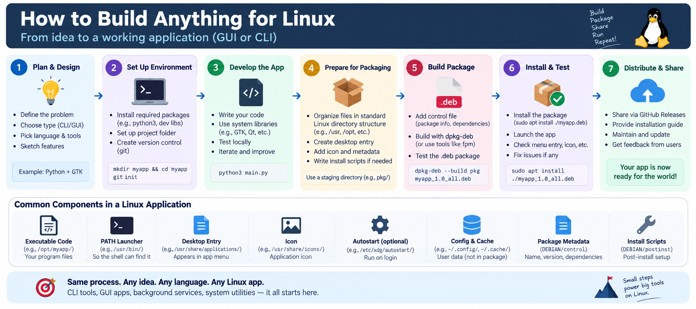

# Have You Ever Wondered How a Linux App Is Actually Built? Let Us Dismantle the Myth

*The story of how any idea becomes a working Linux application, from a blank folder to a package the world can install.*

## Why bother building a Linux app at all?

A few months ago I kept missing prayer times while working on my laptop. My phone knew the times. My laptop, the machine I stared at all day, knew nothing. I went looking for a Linux app I liked, found nothing that fit, and thought: how hard can it be to build one?

That question turned out to be a gift. Most of us use Linux every day but treat it like a sealed box. Apps come from an app store, icons appear, and we never ask where anything went. The moment you build even one small app yourself, the box opens. You learn where programs live, how the system finds them, why some apps start on login while others do not, and why the same code can break just because a different Python showed up first. These are not trivia. They are the kind of knowledge that makes every future bug less scary and every future project faster.

This blog is not a tutorial. You will not find commands to copy blindly (though a few appear when they help the story). Instead, follow the ideas first. Here is my deal with you: read for six minutes, and by the end you will be able to explain to a friend how any Linux app comes to life, and you will know the shape of the whole job before writing a single line of your own.

## The one diagram that explains everything



Keep this picture open. Seven steps, top row left to right, then the common components strip at the bottom. Whether you dream of a CLI helper, a GUI app, a background service or a system utility, the path is the same. I will walk it the way we walked it, using our little timer as the running example but keeping every step generic enough to fit your idea and your language.

## Step 1: Plan and design

Every app starts as a sentence. Ours was: a countdown of the current prayer time, always visible in the top bar. Yours might be: rename a thousand photos in one command, or show laptop battery health in the panel.

Write the sentence down, then answer three small questions. CLI or GUI? A terminal tool is the fastest first build. A GUI takes more work but teaches you desktop integration. Which language and libraries? We picked Python plus GTK because both were already on our system and free. You might pick Go, Rust, C, or plain shell. It truly does not matter. And what are the two or three features that make version one done? Ours were: know the location, compute the times, show the countdown. Everything else waited for later versions. Sketch those features on paper. If you cannot draw it, you cannot build it yet.

## Step 2: Set up your environment

Boring work, but it pays back every day after. Install the language and dev libraries you chose. Make one project folder, ours looked like `mkdir myapp && cd myapp`. Put it under version control from day one with `git init`, even if nobody else will ever see it. The first time a change breaks everything, and it will, that history is your time machine. From here on, every step of this post happens inside that folder.

## Step 3: Develop the app

Now write your code, and test it the small way before the big way. Our habit: make the brain work before giving it a face. We wrote the timing logic first and ran it straight in the terminal:

```bash
python3 main.py
```

No window, no installer, just output on the screen. When that was solid, we attached the top bar display. The same habit fits any app. A CLI tool is already testable the moment it prints something. A GUI app earns the same speed if you keep the core logic runnable without the window, for example through flags:

```bash
myapp --help
myapp --version
myapp --dry-run
myapp --config ~/.config/myapp/config.json
```

If your program answers those four calls sensibly, the core is healthy no matter what the GUI does later. Iterate in this loop for a while: write a little, run it, improve it. Resist the urge to package too early. Packaging a broken app just gives you a neatly wrapped broken app.

## Step 4: Prepare for packaging

This is the step beginners skip, then wonder why their program runs on their machine but nowhere else. Linux has a shared understanding of where things belong, so lay your files out the way the system already looks. Use a staging folder, we call ours `pkg/`, that mirrors the real filesystem. Each address has one job:

- `/opt/myapp/` - your program files, in their own folder so system paths stay clean.
- `/usr/bin/` - a two line launcher, so the shell finds your app by one short name.
- `/usr/share/applications/` - a desktop entry, the only reason an app appears in the app menu.
- `/usr/share/icons/` - your application icon, looked up by theme.
- `/etc/xdg/autostart/` - optional desktop file copy, means run on login.
- `~/.config/` - user settings, created at runtime per user, never shipped.
- `~/.cache/` - fetched or generated data, per user, deletable any time.
- `DEBIAN/control` - package metadata: name, version, dependencies.
- `DEBIAN/postinst` - post install script: refresh the app grid and icon cache.

The bottom strip of the diagram lists exactly these components. Memorize that strip and you already think like a packager.

## Step 5: Build the package

A package is those folders plus two slips of paper. The control file (`DEBIAN/control`) states the name, version and dependencies, so the installer knows what else to bring along. Then a single command seals the box:

```bash
dpkg-deb --build pkg myapp_1.0_all.deb
```

Out comes one file carrying the whole plan. Prefer another tool? Utilities like `fpm` wrap the same idea. The format changes, the thinking does not.

## Step 6: Install and test

Now you switch hats from builder to user. Install on a fresh machine or container:

```bash
sudo apt install ./myapp_1.0_all.deb
```

Then check the three registrations, not just whether it launches. Does the command answer on PATH? Does the app menu entry appear with its icon? Does autostart fire on the next login? Fix whatever is missing at the packaging layer, not by hand tweaking the test machine, or the next user will hit the same gap. Our own greatest hits: installing from the home folder trips an `_apt permission denied` warning (install from `/tmp/` instead), and a conda Python once shadowed the system Python and crashed our GUI, fixed by pinning `/usr/bin/python3` in the launcher.

## Step 7: Distribute and share

A working package wants users. Publish the `.deb` on GitHub Releases with a short changelog, add an installation guide people can follow without you in the room, and keep a visible place for feedback. Then maintain it: version numbers go up, regressions get fixed, ideas from users become the next plan. That loop, plan to release to feedback to plan, is the quiet engine behind every tool you admire.

## The bottom line of the diagram

Read the footer of the picture once more: same process, any idea, any language, any Linux app. CLI tools, GUI apps, background services, system utilities, it all starts here. Small steps power big tools on Linux, and now you know all seven of them.

## Figures used and planned

- Figure 1 (above, after the intro): `images/linux_app_generation_process.png`, the idea to distribution flow.
- Figure 2 (place right after Step 3): a photo style shot of a terminal running `myapp --help` next to the installed app in the system menu. It belongs there because Step 3 is where readers first meet CLI flags.

> IMAGE PROMPT 1: A clean Ubuntu desktop illustration, left side a terminal window showing a sample CLI help output, right side the applications grid with one highlighted new app icon, arrows connecting the two, flat vector style, 16:9.
- Figure 3 (place right after Step 4): the staging folder mirrored against the real filesystem, with arrows from each staged path to its installed twin. It belongs there because Step 4 is where readers meet the staging directory.

> IMAGE PROMPT 2: A diagram showing two directory trees side by side, left labeled staging pkg folder, right labeled installed system, curved arrows mapping each path to its twin, flat vector style, 16:9.

## See a real one

Everything above is the exact path our prayer timer walked. Browse the code, the packaging folders and the release history here: https://github.com/ahmedfahad04/waqt-timer

Pick your sentence, open your folder, and start step one today. The mystery never comes back.
