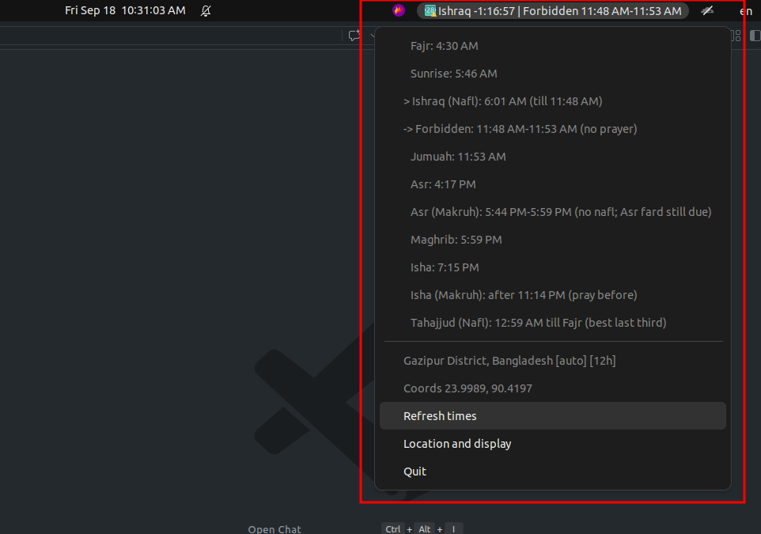
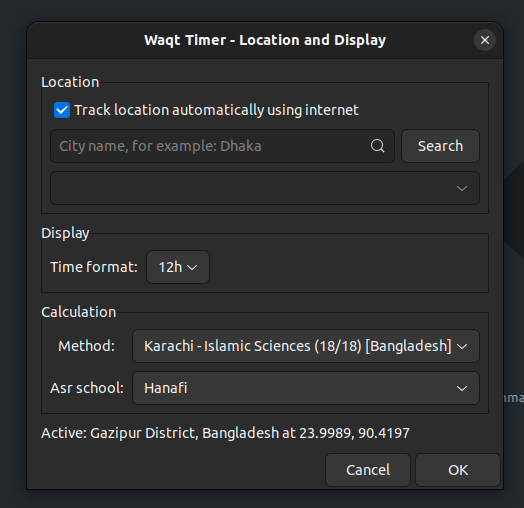

<div align="center">


# Waqt Timer

**Prayer countdown in your Linux top bar. Auto located, district precise, always on time.**

[](CHANGELOG.md)
[](https://github.com/ahmedfahad04/waqt-timer/releases/tag/v1.5.3)
[](https://ubuntu.com)
[](#)
[](https://www.python.org)
[](#configuration)
[](LICENSE)

`Ishraq -1:19:53 | Forbidden 11:48 AM-11:53 AM`

Read how it was built: [Have You Ever Wondered How a Linux App Is Actually Built?](https://medium.com/@ahmedfahad04/have-you-ever-wondered-how-a-linux-app-is-actually-built-let-us-dismantle-the-myth-cbf00114090a)

</div>

## Why this exists

Phone apps know where you are. Linux panel clocks do not. Waqt Timer closes that gap: it lives in the top bar, finds your location over the internet or by city name, fetches the correct times for those exact coordinates, and counts down every second. Built for Bangladesh first (Karachi 18/18, Hanafi Asr, the Islamic Foundation Bangladesh standard), usable anywhere by switching method and school.

## Features

- Top bar countdown: current waqt with `-H:MM:SS` left plus next waqt start, e.g. `Ishraq -1:19:53 | Forbidden 11:48 AM-11:53 AM`.
- Correct waqt order: Fajr ends at Sunrise (never a stale Fajr countdown), then a 15 min sunrise gap, `Ishraq (Nafl)` till zawal.
- Friday Dhuhr shown as Jumuah (same time as Dhuhr).
- Forbidden and makruh windows: noon gap 5 min before Dhuhr (11:48-11:53 Gazipur, matches local apps), `Asr (Makruh)` yellowing ~15 min before Maghrib (Asr fard still due), `Isha (Makruh)` past shar'i midnight, plus a `Tahajjud (Nafl)` best-time row.
- All 23 Aladhan calculation methods (Karachi, MWL, Egypt, Makkah, ISNA, Tehran, Gulf, Kuwait, Qatar, Singapore, France, Turkey, Russia, Moonsighting, Dubai, Malaysia, Tunisia, Algeria, Indonesia, Morocco, Lisbon, Jordan, Shia) plus Hanafi / Shafi Asr, switchable in settings or flags. Changing method refetches every dependent time.
- Auto location over internet, or district search (Shahbag, Sylhet, Rajshahi resolve separately).
- 12h / 24h toggle.
- Offline fallback when the API is down.
- Autostart on login, one codebase for GNOME, KDE, XFCE and MATE.

## Demo

Top bar countdown with the full day menu open (Tongi, auto, 24h):



Location and Display dialog with city search and time format:



## Install

### Option A: git clone and run from source (recommended)

```bash
git clone https://github.com/ahmedfahad04/waqt-timer.git
cd waqt-timer
sudo apt install python3 python3-gi gir1.2-gtk-3.0 gir1.2-ayatanaappindicator3-0.1
python3 pkg/opt/waqt-timer/waqt_timer.py --test
python3 pkg/opt/waqt-timer/waqt_timer.py &
```

To update later: `git pull` and rerun.

### Option B: install from GitHub Releases

Each release ships the `.deb` plus its changelog notes.

1. Open [v1.5.3](https://github.com/ahmedfahad04/waqt-timer/releases/tag/v1.5.3) (or the newest entry on the [Releases](https://github.com/ahmedfahad04/waqt-timer/releases) page) and download `waqt-timer_1.5.3_all.deb`.
2. Read the release notes there before installing, they mirror `CHANGELOG.md`.
3. Install:

```bash
cp ~/Downloads/waqt-timer_1.5.3_all.deb /tmp/
sudo apt install /tmp/waqt-timer_1.5.3_all.deb
waqt-timer --test
waqt-timer &
```

Or in one line with the GitHub CLI:

```bash
gh release download v1.5.3 -R ahmedfahad04/waqt-timer -p '*.deb' -D /tmp && sudo apt install /tmp/waqt-timer_1.5.3_all.deb
```

Use `/tmp/` to avoid the apt `_apt` sandbox warning for home dir files. See `BUILD-GUIDE.md` for the full packaging walkthrough.

## Usage

1. Launch `waqt-timer` from the app grid or terminal.
2. Open `Location and display` from the indicator menu.
3. Either keep `Track location automatically` checked, or type a city and press Enter, pick a result, press OK.
4. Switch `Time format` between `24h` and `12h` as needed.
5. Under Calculation, pick the `Method` matching your local mosque (default Karachi 18/18 for Bangladesh) and the `Asr school` (Hanafi / Shafi).

Handy commands:

```bash
waqt-timer --test --refresh
waqt-timer --test --city "Shahbag, Dhaka" --refresh
waqt-timer --test --city "Sylhet" --refresh --format 12h
waqt-timer --test --school Hanafi --format 24h
waqt-timer --test --method Egypt --school Shafi --refresh
```

## Configuration

| Setting     | Default                          | Where                     |
| ----------- | -------------------------------- | ------------------------- |
| Method      | Karachi (18/18) [Bangladesh]     | Menu, `--method`, config  |
| School      | Hanafi                           | Menu, `--school`          |
| Format      | 24h                              | Menu, `--format`          |
| Config file | -                                | `~/.config/waqt-timer/config.json` |
| Cache       | -                                | `~/.cache/waqt-timer/timings.json` |

Times come from Aladhan with `school=Hanafi, midnightMode=Standard, latitudeAdjustmentMethod=AngleBased`. City search uses Nominatim with Open-Meteo fallback. The cache is keyed by date, coords, method and school, so switching method or school always refetches.

## Roadmap

- [ ] macOS menu bar port: same Aladhan plus Karachi and Hanafi core, native menu bar countdown via rumps.
- [ ] Adhan audio plus desktop notification at each waqt start, with quiet hours toggle.
- [ ] Qibla compass and monthly timetable export for the active location.

## Contributing

1. Fork and create a branch: `git checkout -b fix/my-fix`.
2. Test headless first: `python3 pkg/opt/waqt-timer/waqt_timer.py --test --refresh`.
3. Rebuild the deb: `dpkg-deb --build pkg waqt-timer_1.5.x_all.deb`.
4. Open a pull request with the city you tested and before/after times.

## Releasing

Maintainers ship a version with `release.sh`. It takes the version as an argument, writes the release notes from the matching `## [X.Y.Z]` section of `CHANGELOG.md`, builds `waqt-timer_X.Y.Z_all.deb` when it is not ready yet, pushes the branch and publishes the GitHub release with the `.deb` attached.

```bash
# 1. add the entry to CHANGELOG.md first, e.g. ## [1.5.4] - 2026-09-26
./release.sh 1.5.4 --dry-run    # preview tag, title, notes and asset, change nothing
./release.sh 1.5.4 --commit     # bump version strings, build the .deb, publish
```

| Command | What it does |
| --- | --- |
| `./release.sh 1.5.4 --commit` | Release 1.5.4 end to end |
| `./release.sh 1.5.4 --dry-run` | Show the plan and the notes, write nothing |
| `./release.sh 1.5.4 --rebuild` | Rebuild the `.deb` even if one is already there |
| `./release.sh 1.5.4 --draft` | Publish the release as a draft |
| `./release.sh 1.5.4 --allow-dirty` | Release with uncommitted changes in the tree |

Omit the version to release whatever `Version:` is in `pkg/DEBIAN/control`. The script stops before changing anything if the `## [X.Y.Z]` section is missing, if the tag or release already exists, or if the working tree is dirty and `--commit` was not given. Needs `gh auth login`, `dpkg-deb` and push access to the repository.

## Issues

Found wrong times for your area? Open an issue with:

1. Your city and thana (example: `Shahbag, Dhaka`).
2. Output of `waqt-timer --test --city "Your Area" --refresh`.
3. Your local mosque method if known (Karachi, MWL, other) and Hanafi or Shafi Asr.

## License

MIT. Contact: Istiaq Ahmed Fahad <ahmedfahad3596@gmail.com>. See `CHANGELOG.md` for release history and `BUILD-GUIDE.md` to build any Linux tool this way.
